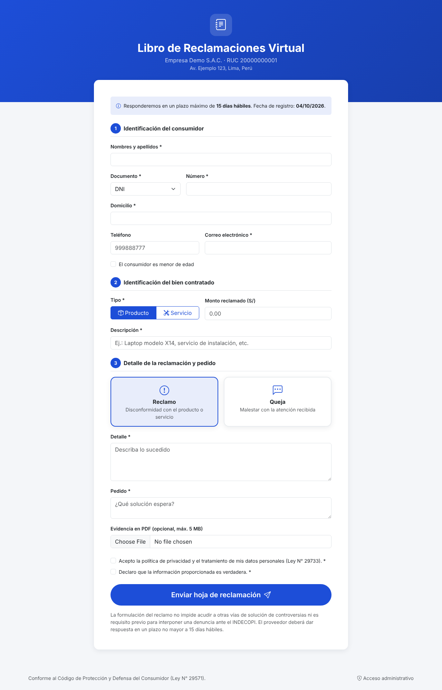
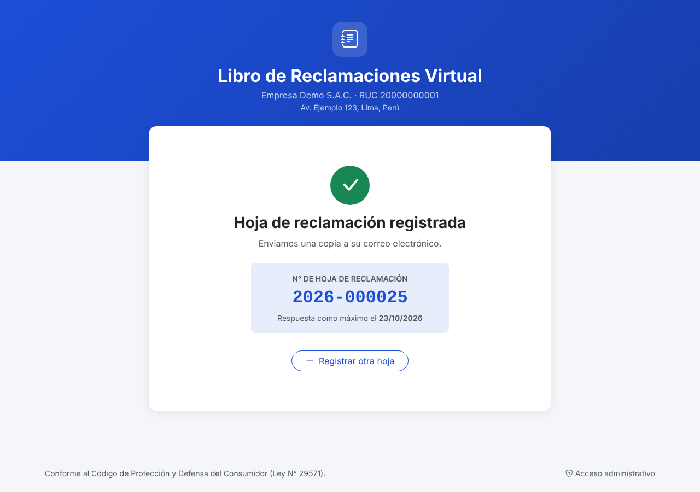
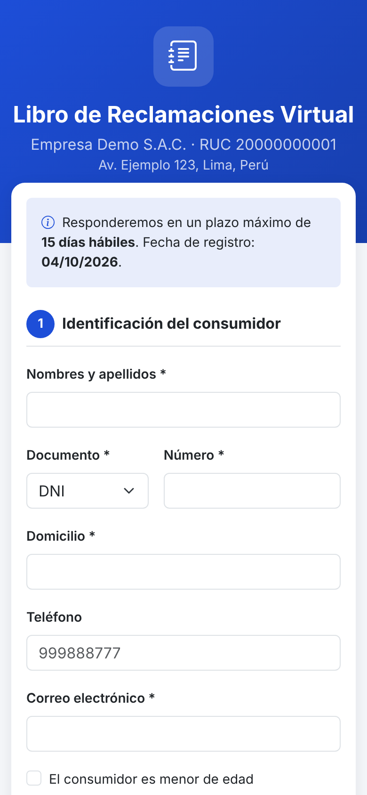
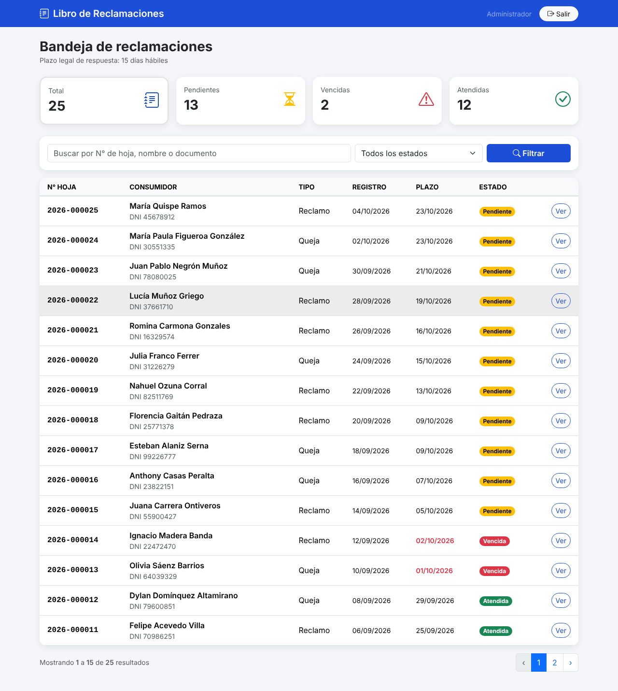
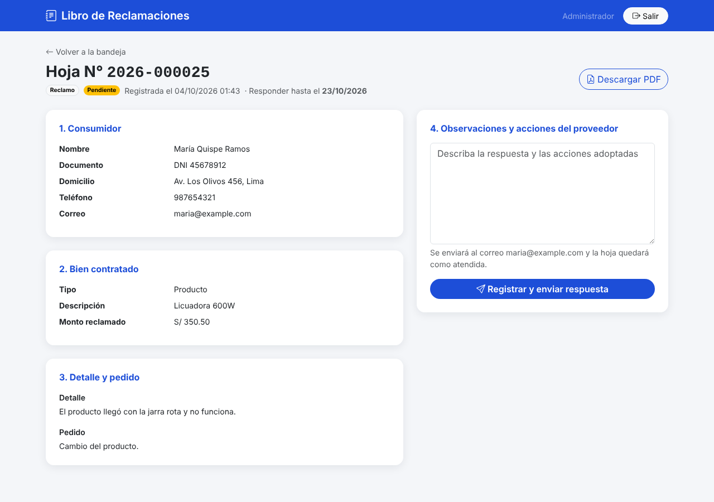

# Libro de Reclamaciones Virtual

[](https://github.com/nestoremilio/libro-reclamaciones-laravel/actions/workflows/tests.yml)


Libro de Reclamaciones virtual para empresas peruanas, alineado a la estructura de la hoja de reclamación del
Código de Protección y Defensa del Consumidor (Ley N° 29571) y su reglamento.

El consumidor registra su reclamo o queja desde cualquier dispositivo, recibe la copia por correo con su número
correlativo y la fecha máxima de respuesta. La empresa gestiona todo desde un panel: plazos, vencidos, respuesta y
reporte PDF.

> Desarrollado por **Néstor Emilio Tamayo Roldán** · [LinkedIn](https://www.linkedin.com/in/nestoremilio)

## Capturas

| Formulario público | Confirmación | Vista móvil |
|---|---|---|
|  |  |  |

| Bandeja administrativa | Detalle y respuesta |
|---|---|
|  |  |

## Funcionalidades

**Para el consumidor**
- Formulario en 3 secciones: consumidor, bien contratado (producto/servicio y monto) y detalle (reclamo o queja).
- Datos del padre, madre o apoderado cuando el consumidor es menor de edad.
- Evidencia opcional en PDF (máx. 5 MB).
- Número correlativo por año (`2026-000001`) y fecha máxima de respuesta en días hábiles.
- Copia de la hoja enviada automáticamente a su correo.
- Diseño responsive (móvil y PC) con validación en tiempo real.

**Para la empresa**
- Bandeja con indicadores: total, pendientes, **vencidas** y atendidas.
- Búsqueda por número de hoja, nombre o documento, y filtros por estado.
- Registro de la respuesta del proveedor, que se envía por correo al consumidor.
- Hoja de reclamación en PDF con la evidencia adjunta al final.
- Datos de la empresa (razón social, RUC, dirección, color de marca y plazo) configurables desde `.env`.

**Seguridad**
- Panel protegido con autenticación y límite de intentos de inicio de sesión.
- Evidencias guardadas en almacenamiento privado (no accesibles por URL pública).
- Sin credenciales en el código: el administrador se crea con `db:seed` usando el `.env`.
- Las hojas no se pueden eliminar desde el panel, para conservar el historial.

## Stack

Laravel 12 · Livewire 4 · Bootstrap 5 · DomPDF + FPDI · MySQL o SQLite · PHPUnit · GitHub Actions

## Instalación

```bash
git clone https://github.com/nestoremilio/libro-reclamaciones-laravel.git
cd libro-reclamaciones-laravel
composer install
cp .env.example .env
php artisan key:generate
touch database/database.sqlite        # o configura MySQL en .env
php artisan migrate
php artisan db:seed                   # crea el administrador (ADMIN_* del .env)
php artisan db:seed --class=DemoSeeder   # opcional: datos de ejemplo
php artisan serve
```

- Formulario: `http://localhost:8000`
- Panel: `http://localhost:8000/login`

Si `ADMIN_PASSWORD` está vacío, el seeder genera una contraseña segura y la muestra en consola.

### Configuración de la empresa (`.env`)

```dotenv
EMPRESA_RAZON_SOCIAL="Empresa Demo S.A.C."
EMPRESA_NOMBRE_COMERCIAL="Empresa Demo"
EMPRESA_RUC=20000000001
EMPRESA_DIRECCION="Av. Ejemplo 123, Lima, Perú"
EMPRESA_COLOR="#1d4ed8"
RECLAMOS_PLAZO_DIAS_HABILES=15
```

Para enviar correos reales configura `MAIL_*` (por defecto quedan en el log).

## Tests

```bash
php artisan test
```

Cubren el registro y la validación del formulario, el correlativo, el cálculo de días hábiles, el envío de correos,
la autenticación, los filtros de la bandeja, la respuesta del proveedor y la descarga del PDF.

## Notas

- El cálculo de días hábiles considera lunes a viernes. Los feriados se pueden agregar en `App\Support\PlazoHabil::$feriados`.
- Este proyecto es una herramienta de apoyo; cada empresa debe verificar que su implementación cumpla la normativa vigente.

## Licencia

[MIT](LICENSE)
